# Variants (circa May 2026)

## Products (the cars)
**Claude.ai (Chat)** --- what we're using right now. Great for thinking, planning, and conversation. No native file system access, so your instruction portability relies on memory features or manually pasting context each session.

**Cowork** --- a desktop app for knowledge workers, running inside a sandboxed Linux VM on your machine. It has 132 pre-built skills and handles document workflows, folder organization, and cross-app automation without needing terminal knowledge. The sandbox makes it safer but limits how deeply you can wire it to your own git-based systems. [Gradually AI](https://www.gradually.ai/en/claude-code-vs-claude-cowork/)

**Claude Code** --- a CLI tool with full filesystem access, IDE integration (VS Code, JetBrains), and configurable permissions. This is the power tool for your model-agnostic goal. The key is `CLAUDE.md` --- a markdown file you commit to any git repo that carries your instruction set everywhere. Switch models, open a new machine, hand a repo to a teammate --- the instructions travel with the code. [Gradually AI](https://www.gradually.ai/en/claude-code-vs-claude-cowork/)

## Platform (the engine)
**The Claude Platform exists because Anthropic is a model company, not just a product company.** Everything you've seen --- Chat, Code, Cowork --- those are Anthropic's own consumer and developer products built *on top* of the platform. But most people will experience AI through one of the things *you've* built on the Claude platform --- that's the actual business thesis. [Simon Willison](https://simonwillison.net/2026/May/6/code-w-claude-2026/)

Think of it this way:

**The platform is the engine. The products are just Anthropic's own cars.**

What the platform gives you that the products don't:

-   **The raw API** --- send messages, get completions, pay per token. You control the UX, the system prompt, the memory, the model selection
-   **Claude Managed Agents** --- a hosted agent product with multi-agent orchestration, Dreaming (agents that learn from past sessions), and Outcomes (define success criteria, run in a loop until achieved) --- all running on Anthropic's infrastructure at scale [Every](https://every.to/chain-of-thought/inside-anthropic-s-2026-developer-conference)
-   **The full toolchain** --- Files API, batch processing, prompt caching, code execution, MCP connectors, all wirable together programmatically
-   The Console --- Anthropic's development environment with a prompt improver, prompt generator, and evaluation tools [Releasebot](https://releasebot.io/updates/anthropic/claude)

**Why this matters for your model-agnostic goal specifically:**

The platform is *where* model-agnosticism actually lives. When you build on the API directly, switching models is a one-line change --- swap `claude-sonnet-4-6` for whatever comes next. Your CLAUDE.md, your prompts, your agent logic --- none of that changes. The platform is the abstraction layer that makes your instruction set portable across model generations.

API volume is up 17x year-on-year on the Anthropic platform --- the growth is all on the builder side, not the chat side. [Every](https://every.to/chain-of-thought/inside-anthropic-s-2026-developer-conference)

## The Personal OS (driver + navigator)
**You're describing a personal operating system.**

-   **Chat** = your thinking layer (strategy, reasoning, planning --- like this conversation)
-   **Code** = your execution layer (the agent that does the work, reads your codebase, commits, runs tests)
-   **Platform API** = your control layer (where you wire your own opinions in --- your prompts, your memory, your model choices)
-   **Mobile** = your approval layer (you stay in the loop without being at a desk)
-   **Git** = your memory and portability layer (instructions, context, history --- model-agnostic by design)

The "opinionated controls" piece is the key insight. Right now you're consuming Anthropic's opinions --- their UX, their defaults, their workflow assumptions. As you progress, you replace those with yours. Your CLAUDE.md becomes your constitution. Your git repo becomes your brain. Your mobile becomes your command center.

The progression is roughly:

1.  **Now** --- understand the ecosystem, pick your tools, start with Claude Code + git discipline
2.  **Near term** --- build your CLAUDE.md, establish your instruction set, lock in your workflow patterns
3.  **Later** --- wire the platform API into your own stack, define your approval flows, make execution location-agnostic (local vs cloud)

---
> - **Cloud Analogy**: *Anthropic = Models are compute/Platform is infra, Products = Managed Services, Personal OS = App Stack*
> - **Personal OS is like building the control plane — the thing that decides what runs, where, when, with what instructions, and who approves it. The models are just a utility underneath it, like electricity. You don't care which power plant generated it.**
---

# Honest Take (Agnostic)
**Safe to use mine** (commoditizing fast, easy to swap):

-   Generation and reasoning --- model outputs are already converging across providers
-   Tool interfaces --- MCP is emerging as a standard, not Anthropic-specific
-   The API call itself --- `messages` endpoint is roughly similar across OpenAI, Anthropic, Google

**Dangerous to let me own** (your instinct is correct):

-   Control plane logic --- orchestration, routing, retry, approval flows
-   Memory and context store --- if it lives in my platform, you can't take it with you
-   Agent scheduling and execution --- Routines, Managed Agents tie you to my infrastructure
-   Instruction sets stored only in Claude-specific formats

**What the enterprise-grade equivalent looks like:**

The pattern you're describing already exists --- it's what mature teams are building on. The stack looks roughly like:

-   **Orchestration** → LangGraph, or your own code --- provider agnostic
-   **Model routing** → LiteLLM or similar --- one interface, swap providers underneath
-   **Memory** → your own store, git-committed, portable
-   **Approval flows** → your own mobile interface, webhooks, not a vendor's app
-   **Instructions** → plain markdown in git, not platform-specific formats

**The honest tension:** CLAUDE.md is useful right now but it's Claude Code-specific. The smarter move is writing your instructions as provider-agnostic system prompts in your own repo, and having a thin adapter that feeds them into whichever model you're calling.

You're not building a Claude OS. You're building **your OS**, and Claude is one of the engines it can call
