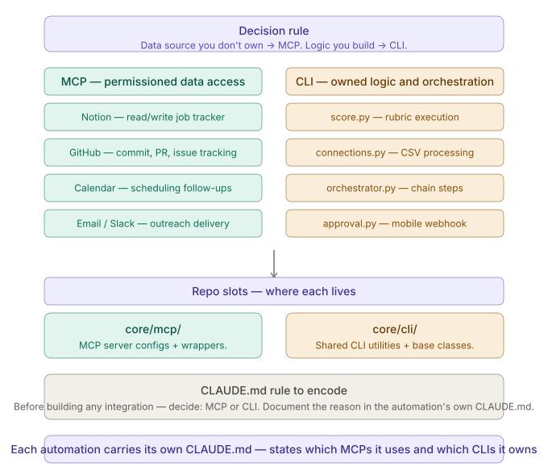

# From Leveraged to Build
## Ideal State

## Evolution
### Task Workflow
???
### Agent Workflow
???

# Repo Structure

# Data
## MCP vs CLI

**MCP** = structured, permissioned, real-time data access. Use it when you need to *read from or write to* a live system with guardrails --- Notion, GitHub, calendar. It's a protocol, not a script. Swappable, standardized, auditable.

**CLI agents** = flexible, composable, buildable. Use when you need to *process, transform, or orchestrate* --- running your scoring logic, parsing the CSV, chaining steps together. You own the code, you own the behavior.

**The decision rule is simple:**

-   Data source you don't own → MCP
-   Logic you build → CLI

So in your stack: Notion reads/writes → MCP. LinkedIn CSV processing → CLI. GitHub commits → MCP. Scoring rubric execution → CLI. Approval webhook → CLI.

# Workflow

Start as a task. Graduate to an agent when judgment, branching, or approval gates appear. Never build an agent for something a task can do — agents are harder to debug, more expensive to run, and harder to trust. Earn the agent.
