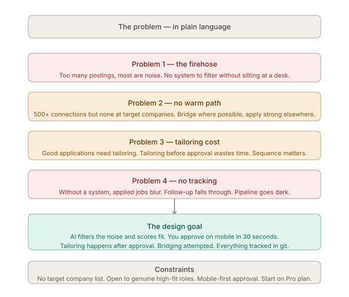
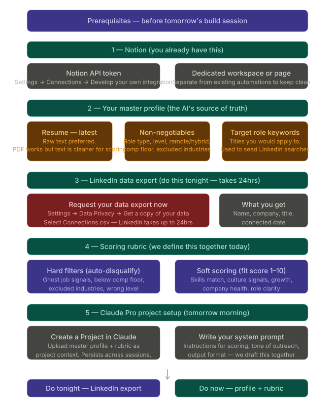
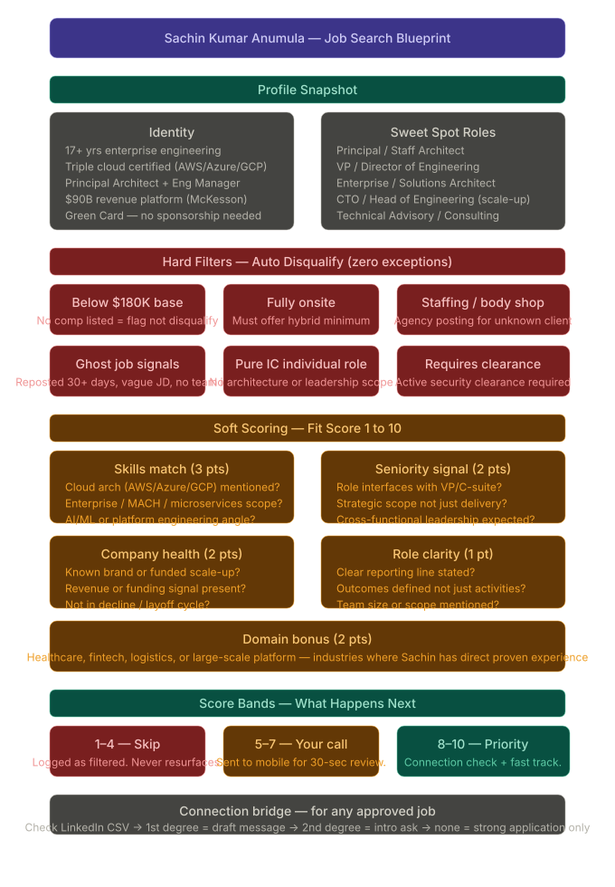

# What I did

## Envision a roadmap

## Establish the problem as a funnel

## Important to realize the power of N

## Merging the idea to consolidated problem statement

## Finally the actual pre-req

# What we agreed upon
